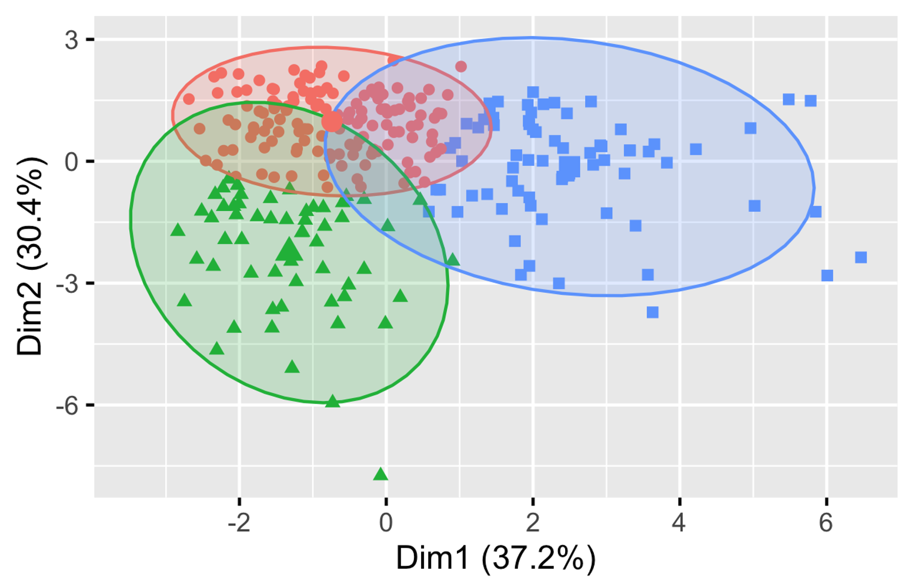
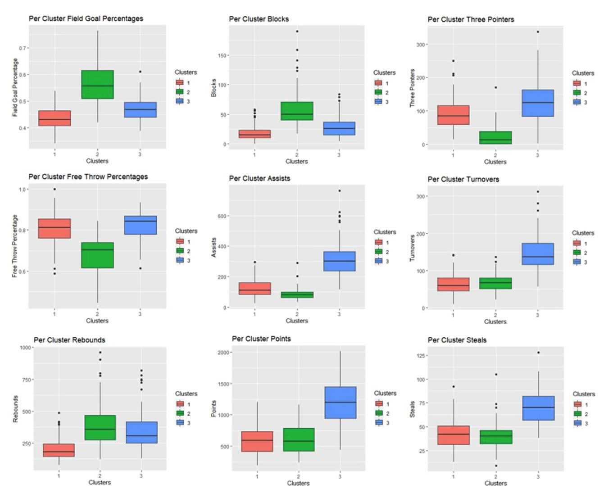
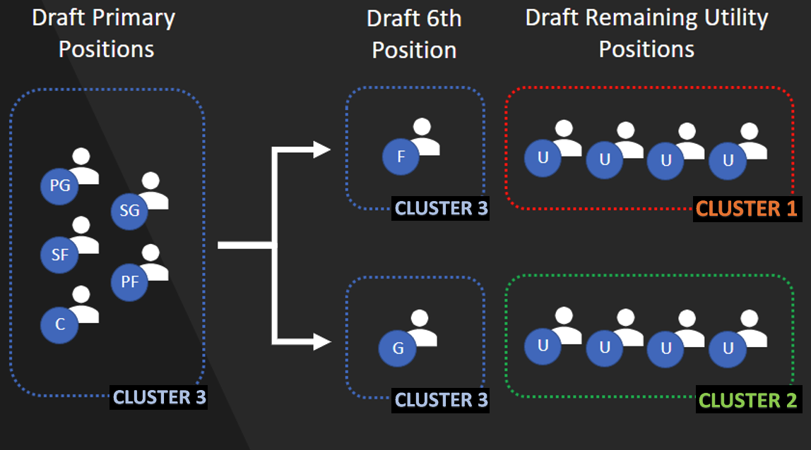

[![Issues][issues-shield]][issues-url]

<h1 align="center">NBA 3K</h1>
<h3 align="center">Fantasy Basketball Virtual Assistant</h3>

    Troy J., Adi B., Romith C.
      
    <a href="https://github.com/rc-9/3K_Fantasy_Basketball/issues">Report Bug</a>
    ·
    <a href="https://github.com/rc-9/3K_Fantasy_Basketball/issues">Request Feature</a>
      
    <!--  -->

## Project Overview

The purpose of this project is to build an end-to-end, data-driven fantasy basketball virtual assistant that automates decisions from draft day to daily lineup selections, waiver wire pickups, and trade targets. This vision is executed through a set of focused tools, each designed to deliver a distinct competitive edge, with the long-term goal of integrating them into a unified, single-point application.

### Hot Streak Finder:

Identifies the most impactful stretches of a player’s season using a divide-and-conquer maximum subarray strategy. 

For a chosen player and statistical category, the tool establishes a seasonal baseline, converts each performance into a deviation from that baseline, then searches for a contiguous run of games that generated the greatest positive lift.

Fantasy outcomes are driven by momentum, role shifts, and short-term surges far more than long-run averages. Managers win by recognizing surges early, not by trusting season summaries. By isolating these windows, the module highlights when production was both elevated and sustained. This supports sharper waiver timing, stronger buy-low/sell-high trade decisions, and more confident lineup locks.

### 9-Cat Cluster Analysis:

Creates a structural map of the fantasy ecosystem by grouping players based on their 9-cat fantasy production, rather than traditional position labels. Using scaled statistical inputs, k-means clustering (k = 3, selected via elbow analysis) transforms raw box score data into practical fantasy archetypes. 

The model identifies natural similarities in statistical production, organizing the league into three repeatable profiles:
- High-usage, across-the-board contributors
- Interior-leaning producers
- Guard/wing-driven outputs
  

Instead of evaluating hundreds of individual stat lines, fantasy managers can approach roster construction by relying on stable player types with predictable strengths and weaknesses. These archetypes form the analytical backbone for downstream decision engines, including a draft simulator.

### Draft Strategy Simulator:

Builds smarter late-round draft strategies by stress-testing roster constructions against each other. 

With archetypes defined, this tool runs large-scale fantasy draft simulations. Early round selections are held to just the high-volume player cluster, while late-round picks are tilted toward different builds (e.g., size-driven production, guard/wing skills). Each simulated roster is then matched head-to-head across categories using historical performance to determine which draft strategy wins more often.

The result is an evidence-based solution for one of fantasy basketball’s hardest challenges: converting late round picks into intentional categorical advantages, rather than an accidental category imbalance.

## Usage

- **`execute_cleaners.py`**  
  Orchestrates the project’s data engineering pipeline by invoking the modular cleaning components.  
  - Inputs: `data/raw`  
  - Outputs: `data/processed`  
  - Cleaning Modules: `cleaners/`

- **`tests/`**  
  Unit tests validating correctness, stability, and expected behavior across the codebase.

- **`utils/`**  
  Core algorithms and reusable building blocks that power the analytical modules.

<!-- MARKDOWN LINKS & IMAGES -->
[issues-shield]: https://img.shields.io/github/issues/rc-9/NBA_3K.svg?style=for-the-badge
[issues-url]: https://github.com/rc-9/NBA_3K/issues

